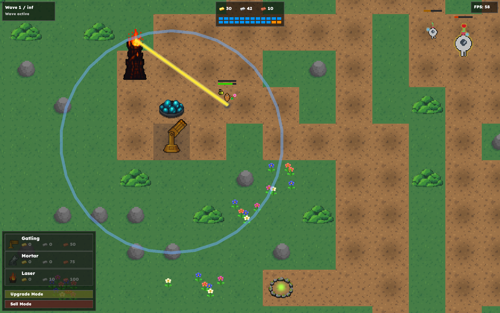
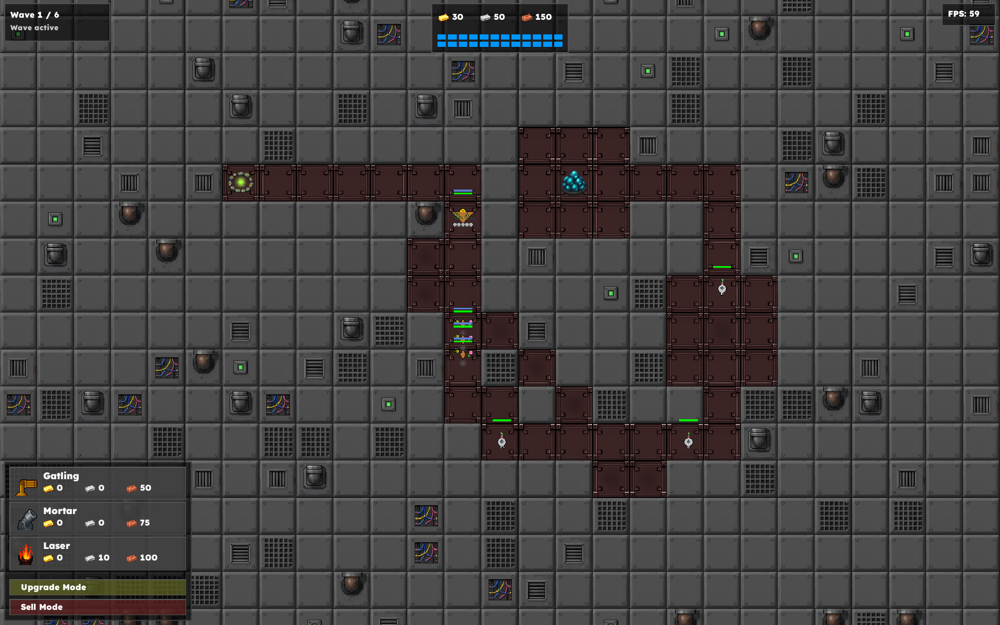
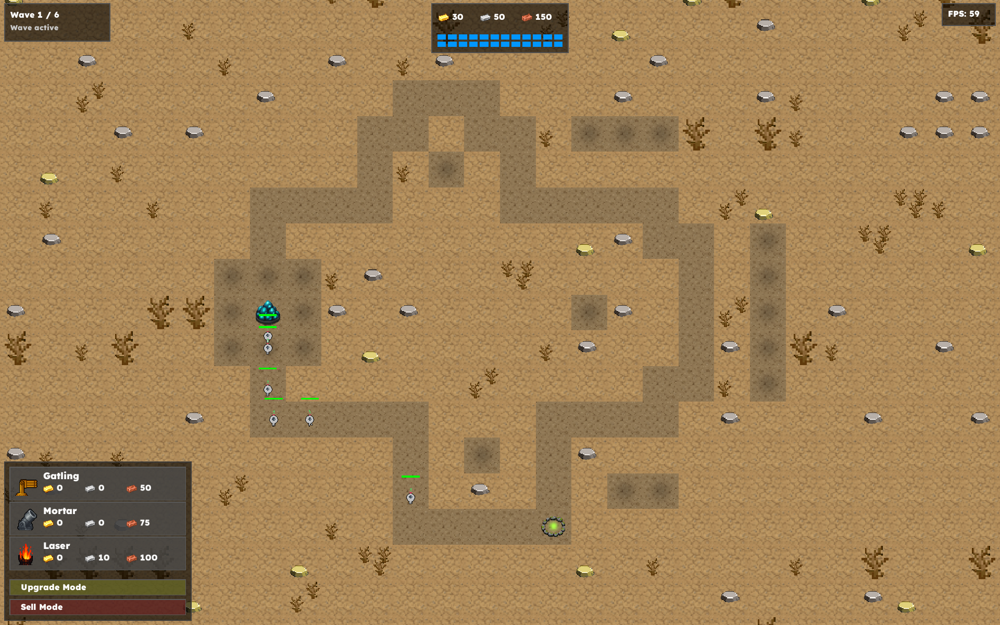
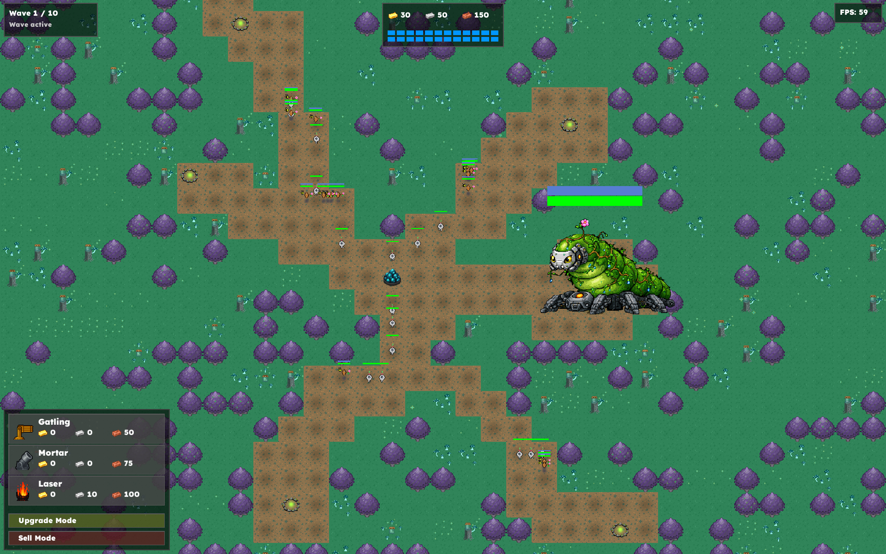
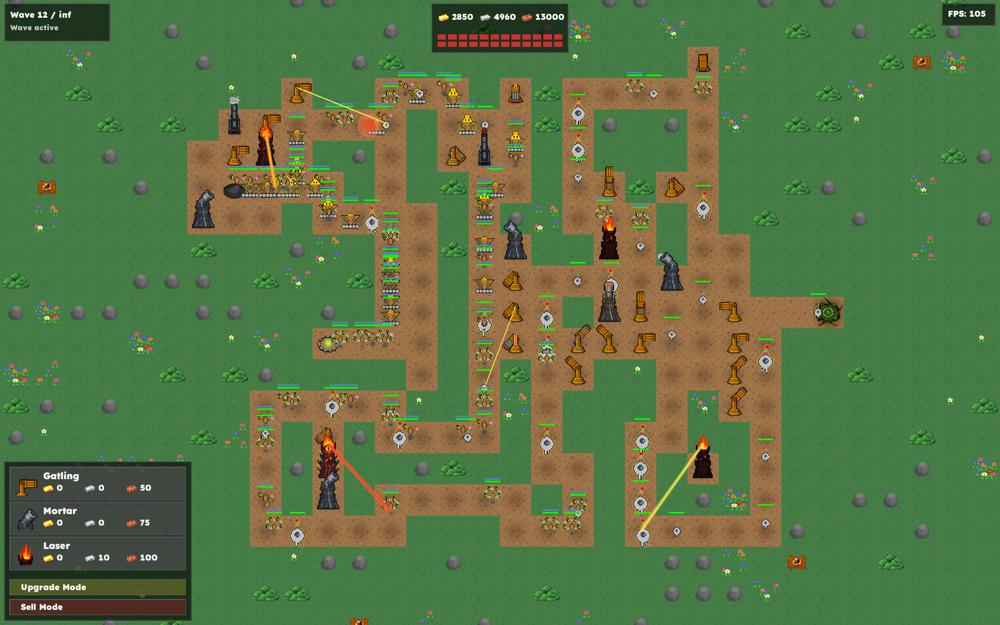

# Tower Defense Game (C++)

This project is a Tower Defense game developed in C++ using the **SFML** library for rendering and **TGUI** for the user interface. The architecture is segmented into three distinct layers: logic core (`tdg::core`), orchestration (`tdg::engine`), and infrastructure (`tdg::infra`).



## How to Play

A ready-to-run executable is available in the **Releases** section of this GitHub repository. Download the latest version, extract the archive, and run the `TowerDefense` executable.

## Technical Features

* **Decoupled Architecture**: Strict separation between business logic and implementation details (rendering, audio, I/O).
* **A* Pathfinding**: Implementation of the A* algorithm with a Manhattan heuristic, optimized to recalculate paths only when the map topology changes.
* **Event System**: Asynchronous communication between entities and managers via typed event queues.
* **Resource Management**: Use of factories for creature and tower instantiation, and a centralized resource manager for texture and sound caching.
* **Rendering Optimization**: Implementation of a "view culling" system (`isInView`) to maintain high performance (120+ FPS) even with numerous active entities.

## Architecture

The project follows a modular structure:

* **tdg::core**: Game rules, world state, and update semantics.
* **tdg::engine**: Main loop, input handling, and GUI interfacing.
* **tdg::infra**: Concrete implementations (SFML rendering, audio, JSON file loading).

## Tech Stack

* **Language**: C++17
* **Graphics**: SFML
* **Interface**: TGUI
* **Build System**: CMake
* **Dependency Management**: vcpkg
* **Data**: JSON files for waves and plain text files for maps.

## Installation & Build (for Developers)

### Prerequisites

Ensure you have a C++17 compatible compiler and CMake installed.

### Build Instructions

1. Clone the repository:
```bash
git clone https://github.com/Cyclemnt/tower-defense-game.git
cd tower-defense-game

```

2. Configure and build:
```bash
mkdir build && cd build
cmake ..
make

```

3. Run the game:
```bash
./tower_defense_cxx

```

## Branch Structure

The repository is organized to ensure transparency of the final deliverable:

* **main**: Official stable version submitted on December 19th.
* **dev**: Development branch containing extended features (Biome system, Roaming Cores, refactored Managers, and CommandBus).

To try the extended version: `git checkout dev`

## Authors

* Clément Lamouller
* Luan Parizot

## License

This project was developed for educational purposes as part of a Computer Science course.

## Screenshots

<table align="center">
  <tr>
    <td align="center"></td>
    <td align="center"></td>
  </tr>
  <tr>
    <td align="center"></td>
    <td align="center"></td>
  </tr>
</table>
